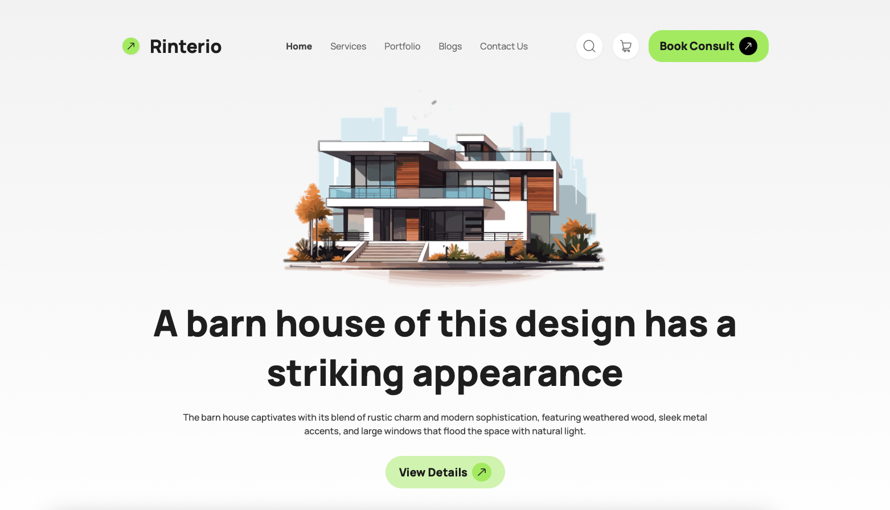

# Rinterio

## Project Overview
Rinterio is a modern interior design website that showcases innovative design solutions for both residential and commercial spaces. The project blends aesthetics with functionality to create an engaging and seamless user experience.

## Live Project Link
https://rakibcodes36.github.io/assignment-03/

## Technologies Used
- HTML
- Tailwind CSS
- DaisyUI
- Google Fonts (Manrope)

## Features
- Elegant and responsive design
- Interactive navigation bar with dropdown menu
- Portfolio showcase with latest designs
- Blog section for design trends and insights
- Contact form for project inquiries

## Dependencies
- [Tailwind CSS](https://cdn.tailwindcss.com)
- [DaisyUI](https://cdn.jsdelivr.net/npm/daisyui@4.12.10/dist/full.min.css)
- [Google Fonts - Manrope](https://fonts.googleapis.com/css2?family=Manrope:wght@200..800&display=swap)

## Installation & Setup
To run the project locally, follow these steps:

1. Clone the repository:
   ```sh
   git clone https://github.com/yourusername/rinterio.git
   ```
2. Navigate to the project folder:
   ```sh
   cd rinterio
   ```
3. Open the `index.html` file in a browser:
   ```sh
   open index.html
   ```
   *(or simply double-click the file to open it in a browser)*

## Screenshots
 *(Replace with an actual screenshot URL)*

## Resources

- **Live Project:**  https://rakibcodes36.github.io/assignment-03/
- **GitHub Repository:**  https://github.com/rakibCodes36/assignment-03
- [Tailwind CSS Documentation](https://tailwindcss.com/docs)
- [DaisyUI Documentation](https://daisyui.com/)
- [Google Fonts](https://fonts.google.com/)

